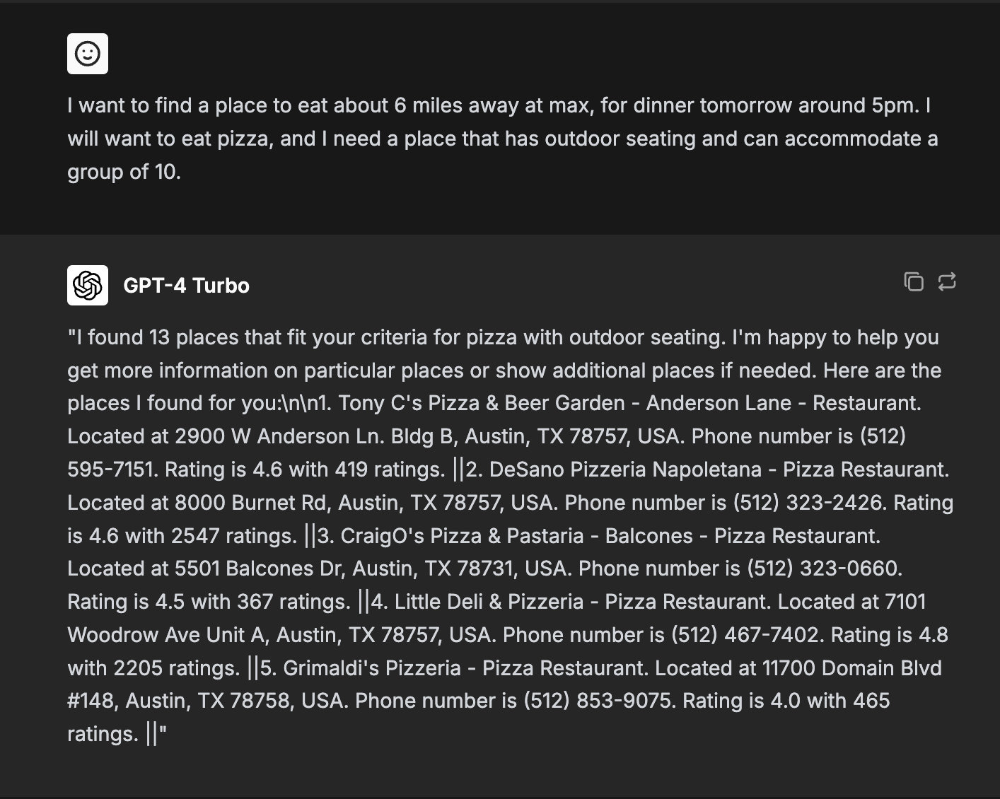

# Food Finder 🔎 🍔

## Overview

`Food-Finder` is a web app that allows you to find places to eat based on your location and preferences. Using an agentic AI approach, the app automatically parses particular aspects of your request, like the type of food, party size, and dietary restrictions, calls Google back the right places, and sorts the places according to what you want/need. This all simplifies the process of finding a place to eat, automating all of the manual decision making involved with weighing the pros and cons of various places.

## The Design and Agent Framework

In a given thread (conversation) for a compiled LangGraph graph, the state that is passed around in the graph (using LangGraph) not only includes the messages sent by user, agent, and tool, but it also includes a record of what the user has requested. It is important to keep this record, so that all agents have access to the same information (local context) and can make informed decisions and work with the same returned place information. For example, if a user later asks in the conversation "Nevermind, instead of Italian food, we decided we want asian food", then the team supervisor agent could make a new call to the cool, update the lists of valid/invalid places, and adjust the preferences accordingly, and not have to worry about recollecting all other preferences.

### Why LangGraph?

Firstly, let's talk [LangChain](https://www.langchain.com/). LangChain is one of the most popular frameworks for building LLM applications, allowing one to build agents and chains that can operate in a sequential manner and have access to tools, granting the ability for LLMs to have access to a powerful range of tasks.

Now, [LangGraph](https://langchain-ai.github.io/langgraph/) is a framework built on top of LangChain that allows for the creation of complex, stateful workflows using a graph-based approach. It provides a way to define a graph of nodes, where each node can be a tool or agent. By conceptualizing the flow of information as state that gets constantly updated as it traverses nodes in a graph, we can build even more powerful LLM applications, that handle non-trivial, non-linear paths to get to the final answer.

LangGraph is used in this project for a multitude of reasons, including:
- The ability to track user food/place preferences in state (which are not explicitly stated in the initial user query), allowing each agent to have access to the same information.
- The ability to modularize different parts of the overall application into separate nodes, which makes the code more organized and easier to maintain.
- The ability to define complex flows (like the one's we've outlined in the design section), which would be very difficult to manage in a linear fashion using vanilla LangChain. One such flow is the incorporation of human feedback in the latter half of the process.
- The ability to leverage the power of visual graphs to reason about the flow of information, and to identify potential bottlenecks or issues in the overall workflow.

### Example Query/Response

## Setting up the Local Environment

### Backend

The backend is built using FastAPI and LangGraph. Install the dependencies in a new virutal environment - `pip install -r requirements.txt` (or, use pipenv, which is a solid alternative and can greatly simplify package management) - and run the backend server using the command `make run`.

### Frontend

The setup of the frontend follows exactly from the code it was built off of, which is [chatbot-ui](https://github.com/mckaywrigley/chatbot-ui). Essentially, all that needs to be done is to install the dependencies, configure the supabase local database, and run the development server, using the command `npm run dev`.

*Note: As it stands, in the frontend code in this repository, the main file that has changed is `frontend/components/chat/chat-helpers/index.ts` (the `handleHostedChat` function). The request body has been adjusted to include the user's coordinates, which are non-null if they opt in to share location on the UI. Make sure that, when running the backend locally, it runs on port 8000. Adjust the specified port in this file if it is not.*

*Note 2: One can dockerize the setup as well, but, the compose file is not yet complete.*

## Query Best Practices

In order to get the best results from `Food-Finder`, it is important to follow these guidelines when crafting your queries:

1. **Be as clear and descriptive as possible**: When providing a description of the type of food you are looking for, please be as clear and descriptive as possible. Use specific keywords that accurately describe the cuisine, such as "Italian", "Japanese", "Mexican", etc.

2. **Include any specific requirements**: If you have any specific requirements, such as dietary restrictions or preferences, please include that information in your query. This will help ensure that the results are tailored to your needs. See the list below for the types of information you can request for.

3. **Use natural language**: Use natural language when describing the type of food you are looking for, rather than technical jargon. This will help ensure that the results are accurate and relevant.

4. **Use words like "want", "nice to have", and "need" to indicate priority**: If certain conditions are must-haves, be sure to include that information in your query using the word "need". The criteria for filtering (both in the Google Maps query and in the following results) depends on preferences the agent determines as "need". Following this keyword, you can 
